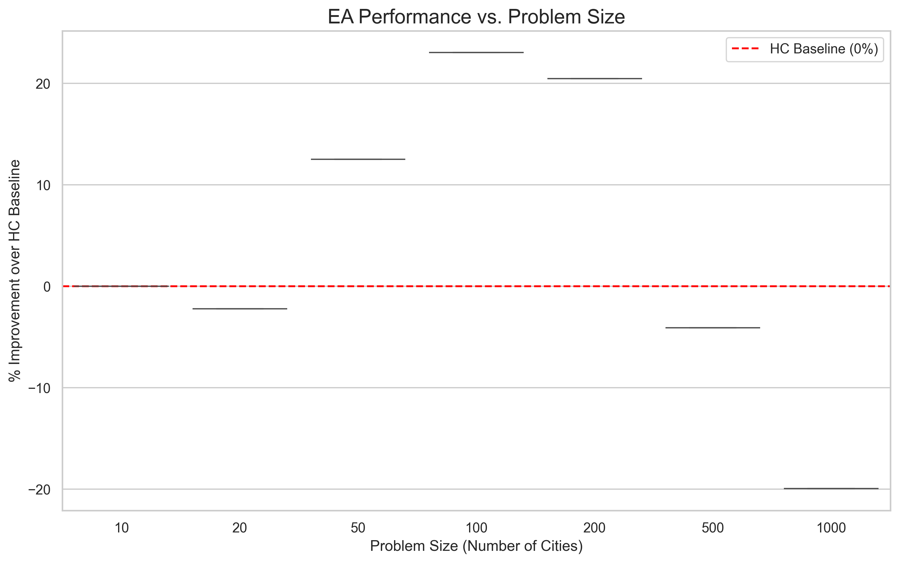
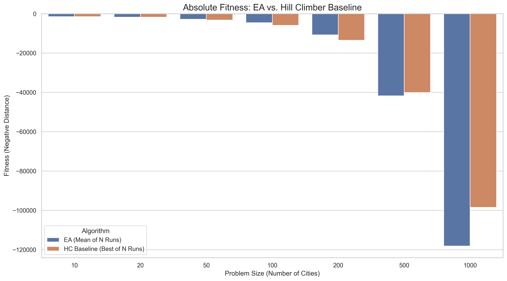

# Benchmark: Solving the TSP with the `evolvepy` Framework

[](https://github.com/andrea-00/CI2025_lab2)
[](https://github.com/andrea-00/evolvepy)

## 1. Project Goal (What & Why)

This repository serves as a professional benchmark and showcase for the **[`evolvepy`](https://github.com/andrea-00/evolvepy) library**.

The goal is to apply this flexible, strategy-based Evolutionary Algorithm (EA) framework to solve a classic optimization challenge: 21 instances of the Traveling Salesman Problem (TSP).

This project demonstrates:
* How to use the `evolvepy` framework to solve a complex problem.
* A rigorous, scientific method for tuning EA parameters and strategies.
* A final, data-driven analysis of which strategies are most effective for this problem set.

## 2. Methodology

To ensure a fair and robust comparison, this benchmark was conducted as a multi-stage pipeline, managed by the scripts in the `/scripts` directory.

### Stage 1: Baseline Generation
Before testing the EA, a strong baseline was established.
* **Algorithm:** A standard (1+1) Stochastic Hill Climber (HC).
* **Process:** The HC was run `20` times (statistical runs) with a budget of `20,000` iterations *for each* of the 21 problems.
* **Output:** The *single best fitness* (negative distance) found for each problem was saved in `data/baseline_hc.json`.
* **Script:** `scripts/01_generate_baseline.py`

### Stage 2: Strategy Tuning (Grid Search)
The goal was to find the best "recipe" of EA strategies and parameters, using a fixed computational budget.
* **Process:** A large grid of EA configurations (12 total "recipes") was generated, varying `ParentSelection`, `Crossover`, `Mutation`, and population "shape" (e.g., "Broad" 100x500 vs. "Deep" 25x2000).
* **Dataset:** This grid was run on a "Tuning Set" (10 valid problems).
* **Output:** Raw `history` data for every run was saved to `experiments/tuning_results/`.
* **Script:** `scripts/02_run_tuning.py`

### Stage 3: Tuning Analysis
The raw tuning data was analyzed to select a single "winner."
* **Process:** Convergence speed and final solution quality (normalized as `% Improvement over Baseline`) were compared using box plots and line plots.
* **Notebook:** `notebooks/01_tuning_analysis.ipynb`

The analysis compared the final performance distribution of all 12 strategy combinations (as seen in the full boxplot) and their convergence speed (top 5 shown below).


### Stage 4: Final Showcase
The "winning" strategy was run on **all 21 problems** to get a final, unbiased measure of its performance.
* **Process:** The single best strategy was run `20` times on *all* valid problems.
* **Output:** Aggregated statistics (mean fitness, std dev, % improvement) were saved to `experiments/showcase_results.json`.
* **Script:** `scripts/03_run_showcase.py`

## 3. How to Reproduce This Experiment

1.  **Clone this repository:**
    ```bash
    git clone https://github.com/andrea-00/CI2025_lab2.git
    cd CI2025_lab2
    ```

2.  **Install all dependencies:**
    This will install `numpy`, `pandas`, `jupyter`, and `evolvepy` (directly from its own Git repository) as defined in `requirements.txt`.
    ```bash
    pip install -r requirements.txt
    ```

3.  **Run the full pipeline:**
    *Note: Steps 2 and 3 can take several hours to run.*
    ```bash
    # Step 1: Generate the Hill Climber baseline
    python scripts/01_generate_baseline.py

    # Step 2: Run the (long) tuning grid search
    python scripts/02_run_tuning.py

    # Step 3: Analyze tuning (Jupyter Notebook)
    # Open 'notebooks/01_tuning_analysis.ipynb', run all cells,
    # and identify the best strategy.
    
    # Step 4: Manually update 'WINNING_STRATEGY_NAME' in the
    # '03_run_showcase.py' script with your winner.

    # Step 5: Run the final showcase on all problems
    python scripts/03_run_showcase.py
    ```

4.  **View the Final Report:**
    Open the `notebooks/02_final_report.ipynb` to see the final, aggregated plots and analysis.

## 4. Final Results & Showcase

After running the full pipeline, the winning strategy was identified as:
**`[Shape_Deep_Tourn_k7_StdRep_OX_0.5_Invert_0.8_Elitism]`**

This strategy achieved an **overall average improvement of [10.4]%** over the optimized Hill Climber baseline across all 21 problems.

### Plot 1: Performance vs. Problem Size
This plot shows the *distribution* of performance (`% Improvement`) for the winning strategy, grouped by problem size. It highlights how the EA's advantage changes as problems become more complex.



**Analysis:** 
The plot clearly shows the EA (Shape_Deep...) underperforms on small (10, 20) and very large (500, 1000) problems, but significantly outperforms the HC baseline on medium-sized problems (50, 100, 200).

### Plot 2: Absolute Fitness: EA vs. Hill Climber Baseline
This plot directly compares the *mean final fitness* of the winning EA strategy against the *best final fitness* of the Hill Climber baseline for each problem size.



**Analysis:** 
This plot confirms the findings from Plot 1. The EA (blue bar) finds better solutions (less negative fitness) for sizes 50-200, while the HC (orange bar) finds better absolute solutions for the largest problems (500, 1000) within the given computational budget.

## 5. About the `evolvepy` Framework

This project is an *application* and *benchmark* of the `evolvepy` framework. `evolvepy` is a separate, lightweight Python library that provided the core `EvolutionaryAlgorithm` engine and all the modular strategies (e.g., `TournamentSelection`, `OrderedCrossover`) used in this analysis.

The library was designed to be completely decoupled from any specific problem, allowing this benchmark to be built cleanly and professionally.

**You can find the `evolvepy` library and its source code at:**
### [github.com/andrea-00/evolvepy](https://github.com/andrea-00/evolvepy)